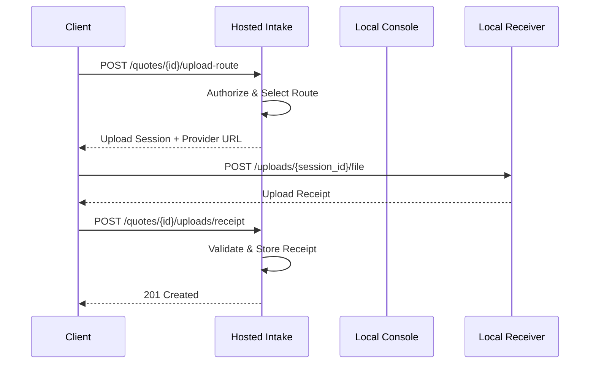

# Hosted Upload Session Broker Architecture

The **Hosted Upload Session Broker** is the central policy authority for all file uploads in the Intake platform. It manages the lifecycle of upload sessions and receipts while maintaining strict security boundaries between the Hosted Intake backend and the Local Intake Console.

## Core Responsibilities

1.  **Route Selection**: Decides where a client should upload files based on provider availability and local console state.
2.  **Session Management**: Issues short-lived, authenticated upload sessions for specific providers.
3.  **Receipt Processing**: Validates and stores cryptographically signed receipts from upload providers.
4.  **Information Redaction**: Ensures that public-facing upload summaries contain no sensitive information (e.g., keys, local paths).

## Component Overview

## Security Guarantees

### 1. Authorization
- **Session Required**: All upload actions require an authenticated client session.
- **Verified Email**: If configured, only clients with verified emails can request upload routes.
- **Quote Ownership**: Clients can only upload to quotes they own.
- **Status Gate**: Uploads are only allowed for quotes in specific states (e.g., `draft`, `submitted`).

### 2. Provider Isolation
- **Broker Chooses Route**: The client cannot specify an arbitrary upload URL; the broker provides the authoritative route.
- **No Credentials**: Public APIs never expose provider credentials or internal tokens.
- **Session Expiry**: Upload sessions are time-limited and cannot be reused across quotes.

### 3. Data Redaction
- **No Local Paths**: Receipts are audited to ensure no absolute local filesystem paths are stored or exposed.
- **No Plaintext Names**: Original filenames are encrypted at rest; public summaries only show redacted metadata.
- **No Ciphertext Internals**: Public responses never include IVs, tags, or raw encrypted bytes.

## API Contracts

### `POST /quotes/{quote_id}/upload-route`
Request an authoritative upload route for a specific quote.
- **Returns**: `UploadRouteDecision` (Provider type, Public URL, Session Token).

### `POST /quotes/{quote_id}/uploads/receipt`
Submit a completed upload receipt to the hosted backend.
- **Input**: `LocalUploadReceipt` (SHA256, Size, Storage Provider).
- **Validation**: Verifies that the receipt matches an active session and the quote ID.

### `GET /quotes/{quote_id}/uploads`
Retrieve a public summary of all uploaded files for a quote.
- **Returns**: `list[UploadSummary]` (Redacted metadata only).

## Current Limitations

- **Tunnel Activation**: Tunneling (Tailscale/Cloudflare) is currently dry-run only; the broker assumes local loopback for v0.
- **Fallback Storage**: Google Drive fallback is planned but not implemented.
- **Protocol**: Currently limited to multipart v0; resumable `tus` protocol is planned for v1.
- **Receipt Signing**: Receipt verification is based on session tokens; asymmetric signing from the receiver is a future enhancement.
